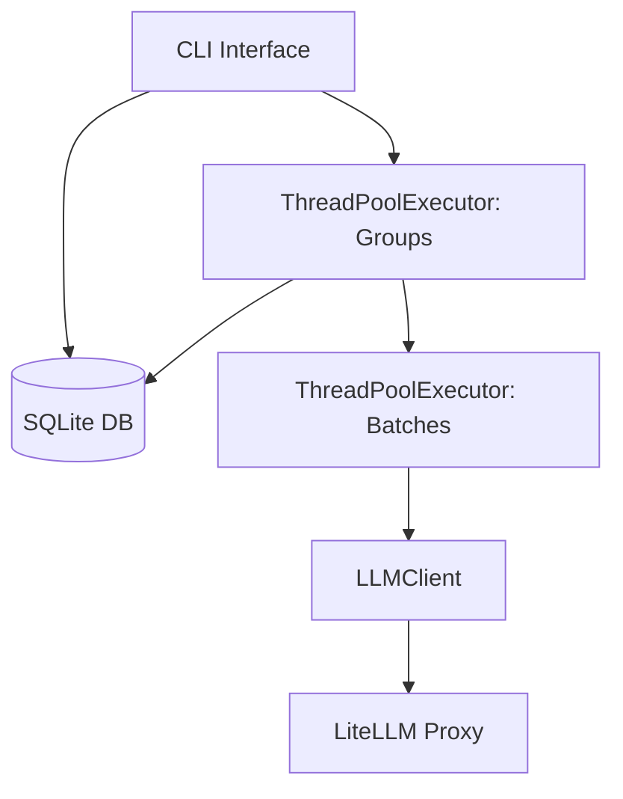
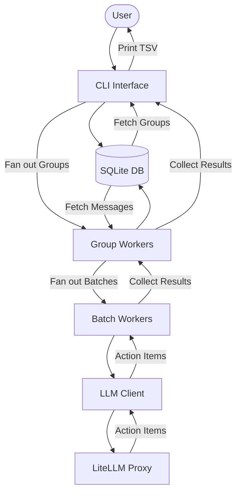

# Parallel Processing Architecture

This document describes the architecture and data flow for the parallel processing implementation in the WhatsApp Action Agent.

## Architecture Diagram

The following diagram shows the components involved in the parallel processing pipeline.

## Data Flow Diagram

The following diagram illustrates the flow of data from the initial user command to the final TSV output.

